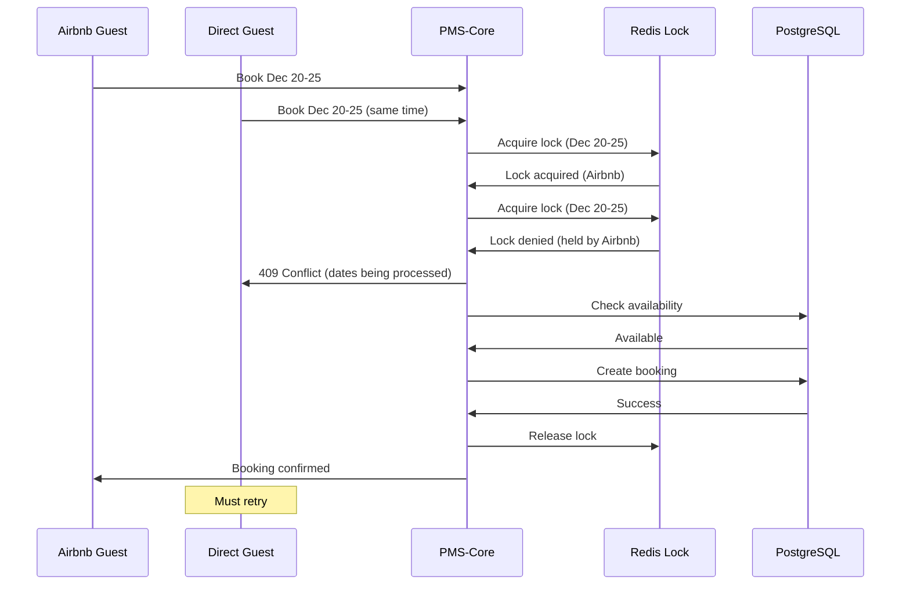

# Conflict Resolution Strategies

## Overview

The Channel Manager must handle various conflict scenarios that arise from bidirectional sync between PMS-Core and external booking platforms. This document defines the conflict resolution strategies and their implementation.

---

## 1. Conflict Categories

### 1.1 Booking Conflicts

| Conflict Type | Description | Severity |
|--------------|-------------|----------|
| Double Booking | Same dates booked on multiple platforms simultaneously | Critical |
| Status Mismatch | Different booking status between PMS and channel | High |
| Guest Data Conflict | Different guest information between systems | Medium |
| Price Discrepancy | Price difference between PMS and channel | Medium |
| Date Modification | Check-in/out dates changed on one system | High |

### 1.2 Availability Conflicts

| Conflict Type | Description | Severity |
|--------------|-------------|----------|
| Availability Drift | PMS shows available, channel shows blocked | High |
| Block Overlap | Manual block conflicts with channel sync | Medium |
| Stale Data | Outdated availability due to sync delay | High |

### 1.3 Pricing Conflicts

| Conflict Type | Description | Severity |
|--------------|-------------|----------|
| Price Drift | Prices out of sync between PMS and channels | Medium |
| Currency Mismatch | Different currencies causing calculation errors | High |
| Rate Plan Conflict | Different rate plans applied | Medium |

---

## 2. Core Principle: PMS-Core as Source of Truth

**Golden Rule**: PMS-Core is the authoritative source of truth for all booking data. When conflicts arise:

1. **Direct Bookings**: PMS-Core data always wins
2. **Channel Bookings**: Channel data wins for initial import, PMS-Core wins for subsequent updates
3. **Availability**: PMS-Core determines true availability, channels must sync to PMS

---

## 3. Conflict Resolution Strategies

### 3.1 Simultaneous Booking (Race Condition)

**Scenario**: Guest books on Airbnb while another guest books the same dates directly.

```python
# Strategy: First-write-wins with distributed locking

from contextlib import asynccontextmanager
import redis.asyncio as aioredis

class BookingLockManager:
    """
    Distributed lock manager for preventing double-bookings.
    Uses Redis for coordination across multiple workers.
    """

    def __init__(self, redis_url: str):
        self.redis = aioredis.from_url(redis_url)
        self.lock_ttl = 300  # 5 minutes

    def _get_lock_key(
        self,
        property_id: UUID,
        check_in: date,
        check_out: date
    ) -> str:
        """Generate a lock key for the date range."""
        return f"booking_lock:{property_id}:{check_in}:{check_out}"

    @asynccontextmanager
    async def acquire_booking_lock(
        self,
        property_id: UUID,
        check_in: date,
        check_out: date,
        requester_id: str
    ):
        """
        Acquire a distributed lock for booking creation.

        This prevents race conditions when multiple booking requests
        arrive simultaneously for the same dates.
        """
        lock_key = self._get_lock_key(property_id, check_in, check_out)

        # Try to acquire lock with NX (only if not exists)
        acquired = await self.redis.set(
            lock_key,
            requester_id,
            nx=True,
            ex=self.lock_ttl
        )

        if not acquired:
            # Lock held by another process
            holder = await self.redis.get(lock_key)
            raise BookingConflict(
                f"Dates {check_in} to {check_out} are being processed "
                f"by another booking request (holder: {holder})"
            )

        try:
            yield
        finally:
            # Only release if we still hold the lock
            current_holder = await self.redis.get(lock_key)
            if current_holder == requester_id:
                await self.redis.delete(lock_key)


async def create_booking_with_lock(
    property_id: UUID,
    check_in: date,
    check_out: date,
    source: str,
    booking_data: dict
) -> Booking:
    """
    Create a booking with distributed locking to prevent double-bookings.
    """
    lock_manager = BookingLockManager(settings.REDIS_URL)
    requester_id = f"{source}:{uuid.uuid4()}"

    async with lock_manager.acquire_booking_lock(
        property_id, check_in, check_out, requester_id
    ):
        # Step 1: Check availability (within lock)
        is_available = await check_availability(property_id, check_in, check_out)
        if not is_available:
            raise BookingConflict(
                f"Dates {check_in} to {check_out} are no longer available"
            )

        # Step 2: Create booking
        try:
            booking = await create_booking_record(
                property_id=property_id,
                check_in=check_in,
                check_out=check_out,
                source=source,
                **booking_data
            )
        except IntegrityError as e:
            # Database exclusion constraint caught the conflict
            raise BookingConflict(
                "Database prevented double-booking (exclusion constraint)"
            )

        # Step 3: Sync to channels
        await sync_availability_to_channels(
            property_id=property_id,
            check_in=check_in,
            check_out=check_out,
            available=False,
            exclude_channel=source if source != "direct" else None
        )

        return booking
```

**Resolution Flow**:



### 3.2 Status Update Conflict

**Scenario**: Booking cancelled on Airbnb while host modifies it in PMS.

```python
async def resolve_status_conflict(
    booking: Booking,
    pms_status: str,
    channel_status: str,
    channel_type: str,
    channel_updated_at: datetime
) -> str:
    """
    Resolve status conflicts between PMS and channel.

    Resolution Rules:
    1. For channel-originated bookings: Channel status wins
    2. For direct bookings: PMS status wins
    3. Cancellations always win over other statuses
    4. More recent update wins for same-source changes
    """

    # Rule: Cancellation always wins
    if channel_status == "cancelled" or pms_status == "cancelled":
        final_status = "cancelled"

        # If cancelled on channel, update PMS
        if channel_status == "cancelled" and pms_status != "cancelled":
            await update_booking_status(booking.id, "cancelled", source=channel_type)
            await log_conflict_resolution(
                booking.id,
                "status_conflict",
                f"Channel cancellation overrides PMS status ({pms_status})"
            )

        # If cancelled in PMS, sync to channels
        elif pms_status == "cancelled" and channel_status != "cancelled":
            await sync_cancellation_to_channels(booking)

        return final_status

    # Rule: For channel bookings, channel status wins
    if booking.source != "direct":
        if pms_status != channel_status:
            await update_booking_status(booking.id, channel_status, source=channel_type)
            await log_conflict_resolution(
                booking.id,
                "status_conflict",
                f"Channel status ({channel_status}) overrides PMS status ({pms_status})"
            )
        return channel_status

    # Rule: For direct bookings, PMS status wins
    else:
        if pms_status != channel_status:
            await sync_status_to_channels(booking.id, pms_status)
            await log_conflict_resolution(
                booking.id,
                "status_conflict",
                f"PMS status ({pms_status}) synced to channels"
            )
        return pms_status
```

### 3.3 Guest Data Conflict

**Scenario**: Guest updates their phone number on Airbnb after booking.

```python
async def merge_guest_data(
    existing_guest: Guest,
    channel_guest_data: dict,
    channel_type: str
) -> Guest:
    """
    Merge guest data from channel with existing PMS data.

    Strategy:
    - Email and Name: PMS data wins (identity fields)
    - Phone: Most recent non-null value wins
    - Address: Channel data supplements PMS data
    - Preferences: Merge with channel preferences taking precedence
    """

    updates = {}

    # Phone: Use most recent if PMS is empty or older
    channel_phone = channel_guest_data.get("phone")
    if channel_phone and (
        not existing_guest.phone or
        existing_guest.updated_at < datetime.utcnow() - timedelta(hours=1)
    ):
        updates["phone"] = channel_phone

    # Address: Only update if PMS address is empty
    if not existing_guest.address and channel_guest_data.get("address"):
        updates["address"] = channel_guest_data["address"]

    # Language preference: Channel knows guest's current preference
    if channel_guest_data.get("language"):
        updates["language"] = channel_guest_data["language"]

    if updates:
        await update_guest(existing_guest.id, updates)
        await log_guest_data_merge(
            existing_guest.id,
            channel_type,
            updates
        )

    return await get_guest(existing_guest.id)
```

### 3.4 Price Discrepancy

**Scenario**: Price changed in PMS but channel shows old price.

```python
async def handle_price_discrepancy(
    booking: Booking,
    channel_price: Decimal,
    pms_price: Decimal,
    channel_type: str
) -> dict:
    """
    Handle price discrepancy between channel and PMS.

    Strategy:
    - For new channel bookings: Accept channel price (guest already paid)
    - For existing bookings: Flag for manual review if difference > threshold
    - Always log discrepancies for reconciliation
    """

    threshold_percent = Decimal("5")  # 5% difference threshold
    difference = abs(channel_price - pms_price)
    difference_percent = (difference / pms_price) * 100

    resolution = {
        "booking_id": str(booking.id),
        "pms_price": float(pms_price),
        "channel_price": float(channel_price),
        "difference": float(difference),
        "difference_percent": float(difference_percent),
        "action": None,
        "requires_review": False
    }

    if booking.source == "direct":
        # Direct booking: PMS price is correct
        resolution["action"] = "use_pms_price"
        resolution["final_price"] = float(pms_price)

        # Sync correct price to channels
        if difference > 0:
            await sync_booking_price_to_channels(booking)

    elif booking.source != "direct" and booking.status == "pending":
        # New channel booking: Accept channel price (guest already committed)
        resolution["action"] = "accept_channel_price"
        resolution["final_price"] = float(channel_price)

        # Update PMS with channel price
        await update_booking_price(booking.id, channel_price)

        if difference_percent > threshold_percent:
            # Flag for review if significant difference
            resolution["requires_review"] = True
            await create_price_discrepancy_alert(
                booking_id=booking.id,
                channel_type=channel_type,
                expected_price=pms_price,
                actual_price=channel_price
            )

    else:
        # Existing confirmed booking: Flag for manual review
        resolution["action"] = "flag_for_review"
        resolution["requires_review"] = True
        await create_price_discrepancy_alert(
            booking_id=booking.id,
            channel_type=channel_type,
            expected_price=pms_price,
            actual_price=channel_price
        )

    # Always log the discrepancy
    await log_price_discrepancy(resolution)

    return resolution
```

### 3.5 Date Modification Conflict

**Scenario**: Guest requests date change on Airbnb while host already blocked those dates.

```python
async def resolve_date_modification(
    booking: Booking,
    new_check_in: date,
    new_check_out: date,
    channel_type: str,
    modification_source: str  # "channel" or "pms"
) -> dict:
    """
    Resolve date modification conflicts.

    Strategy:
    1. Check if new dates are available
    2. If from channel and available: Accept modification
    3. If from channel and unavailable: Reject and notify
    4. If from PMS: Apply modification and sync to channels
    """

    result = {
        "booking_id": str(booking.id),
        "original_dates": {
            "check_in": str(booking.check_in),
            "check_out": str(booking.check_out)
        },
        "requested_dates": {
            "check_in": str(new_check_in),
            "check_out": str(new_check_out)
        },
        "source": modification_source,
        "status": None,
        "reason": None
    }

    # Check availability for new dates (excluding current booking)
    is_available = await check_availability_excluding_booking(
        property_id=booking.property_id,
        check_in=new_check_in,
        check_out=new_check_out,
        exclude_booking_id=booking.id
    )

    if modification_source == "channel":
        if is_available:
            # Accept the modification
            await update_booking_dates(
                booking.id,
                new_check_in,
                new_check_out
            )

            # Sync to other channels
            await sync_date_change_to_channels(
                booking=booking,
                new_check_in=new_check_in,
                new_check_out=new_check_out,
                exclude_channel=channel_type
            )

            result["status"] = "accepted"
            result["reason"] = "New dates available, modification applied"

        else:
            # Reject the modification
            result["status"] = "rejected"
            result["reason"] = "New dates not available"

            # Notify property owner
            await send_modification_conflict_notification(
                booking=booking,
                requested_dates=(new_check_in, new_check_out),
                channel_type=channel_type
            )

            # The channel booking may need manual intervention
            await create_modification_conflict_task(
                booking_id=booking.id,
                channel_type=channel_type,
                requested_dates=(new_check_in, new_check_out)
            )

    elif modification_source == "pms":
        if is_available:
            await update_booking_dates(
                booking.id,
                new_check_in,
                new_check_out
            )

            # Sync to all channels including source channel
            await sync_date_change_to_channels(
                booking=booking,
                new_check_in=new_check_in,
                new_check_out=new_check_out
            )

            result["status"] = "accepted"
        else:
            result["status"] = "rejected"
            result["reason"] = "New dates not available"

    await log_date_modification(result)
    return result
```

---

## 4. Availability Drift Detection & Correction

### 4.1 Drift Detection

```python
async def detect_availability_drift(
    connection: ChannelConnection
) -> List[AvailabilityMismatch]:
    """
    Detect availability drift between PMS and channel.

    Runs as part of daily reconciliation.
    """

    # Fetch channel availability
    adapter = await AdapterFactory.create_adapter(connection)
    start_date = date.today()
    end_date = start_date + timedelta(days=90)

    channel_availability = await adapter.get_availability(
        property_id=connection.channel_property_id,
        start_date=start_date,
        end_date=end_date
    )

    # Fetch PMS availability
    pms_availability = await get_calendar_availability(
        property_id=connection.property_id,
        start_date=start_date,
        end_date=end_date
    )

    # Compare and find mismatches
    mismatches = []
    for cal_date, pms_available in pms_availability.items():
        channel_available = channel_availability.get(cal_date)

        if channel_available is not None and channel_available != pms_available:
            mismatches.append(AvailabilityMismatch(
                date=cal_date,
                pms_available=pms_available,
                channel_available=channel_available,
                channel_type=connection.channel_type
            ))

    return mismatches
```

### 4.2 Drift Correction

```python
async def correct_availability_drift(
    connection: ChannelConnection,
    mismatches: List[AvailabilityMismatch],
    auto_correct: bool = True
) -> dict:
    """
    Correct availability drift.

    Strategy:
    - PMS is source of truth
    - Push PMS availability to channel
    - Log all corrections for audit
    """

    result = {
        "connection_id": str(connection.id),
        "channel_type": connection.channel_type,
        "mismatches_found": len(mismatches),
        "corrected": 0,
        "failed": 0,
        "details": []
    }

    if not auto_correct:
        # Just report, don't fix
        result["action"] = "report_only"
        for mismatch in mismatches:
            result["details"].append({
                "date": str(mismatch.date),
                "pms_available": mismatch.pms_available,
                "channel_available": mismatch.channel_available
            })
        return result

    # Group consecutive dates for efficient updates
    date_groups = group_consecutive_dates(mismatches)

    for group in date_groups:
        start_date = group[0].date
        end_date = group[-1].date + timedelta(days=1)
        pms_available = group[0].pms_available  # All same in group

        try:
            await update_channel_availability.delay(
                connection_id=str(connection.id),
                check_in=str(start_date),
                check_out=str(end_date),
                available=pms_available
            )
            result["corrected"] += len(group)

        except Exception as e:
            result["failed"] += len(group)
            result["details"].append({
                "dates": f"{start_date} to {end_date}",
                "error": str(e)
            })

    # Log the reconciliation
    await log_drift_correction(
        connection_id=connection.id,
        mismatches=len(mismatches),
        corrected=result["corrected"],
        failed=result["failed"]
    )

    # Alert if too many mismatches
    if len(mismatches) > 10:
        await send_drift_alert(
            connection=connection,
            mismatch_count=len(mismatches)
        )

    return result
```

---

## 5. Conflict Resolution Rules Summary

### 5.1 Decision Matrix

| Conflict Type | Source | Winner | Action |
|--------------|--------|--------|--------|
| Double Booking | Both | First to acquire lock | Reject second |
| Status (cancellation) | Any | Cancelled status | Sync cancellation |
| Status (other) | Channel booking | Channel | Update PMS |
| Status (other) | Direct booking | PMS | Sync to channels |
| Guest Email/Name | Any | PMS | Keep PMS data |
| Guest Phone | Channel (newer) | Channel | Update PMS |
| Price (new booking) | Channel | Channel | Accept and log |
| Price (existing) | Any | Flag for review | Manual review |
| Date change | Channel | Accept if available | Reject if unavailable |
| Date change | PMS | PMS | Sync to channels |
| Availability | Any | PMS | Sync PMS to channels |

### 5.2 Escalation Rules

Conflicts that require human intervention:

1. **Price difference > 5%** on confirmed bookings
2. **Date modification conflicts** (requested dates unavailable)
3. **Multiple consecutive sync failures** (>3 failures)
4. **Availability drift > 10 days** in 90-day window
5. **Guest dispute** flags from channels

---

## 6. Conflict Logging & Audit Trail

```python
from enum import Enum
from datetime import datetime
from uuid import UUID

class ConflictType(str, Enum):
    DOUBLE_BOOKING = "double_booking"
    STATUS_MISMATCH = "status_mismatch"
    GUEST_DATA = "guest_data"
    PRICE_DISCREPANCY = "price_discrepancy"
    DATE_MODIFICATION = "date_modification"
    AVAILABILITY_DRIFT = "availability_drift"


async def log_conflict_resolution(
    entity_id: UUID,
    entity_type: str,  # "booking", "guest", "availability"
    conflict_type: ConflictType,
    resolution: str,
    details: dict,
    resolved_by: str = "system"
) -> None:
    """
    Log conflict resolution to audit trail.
    """
    await db.execute(
        insert(audit_log).values(
            tenant_id=get_current_tenant_id(),
            entity_type=entity_type,
            entity_id=entity_id,
            action="conflict_resolved",
            new_data={
                "conflict_type": conflict_type.value,
                "resolution": resolution,
                "details": details,
                "resolved_by": resolved_by,
                "resolved_at": datetime.utcnow().isoformat()
            }
        )
    )
```

---

## 7. Monitoring & Alerting

### 7.1 Conflict Metrics

```python
# Prometheus metrics for conflict monitoring
from prometheus_client import Counter, Histogram

CONFLICTS_TOTAL = Counter(
    "channel_conflicts_total",
    "Total conflicts detected",
    ["conflict_type", "channel_type"]
)

CONFLICT_RESOLUTION_TIME = Histogram(
    "channel_conflict_resolution_seconds",
    "Time to resolve conflicts",
    ["conflict_type"]
)

CONFLICTS_REQUIRING_REVIEW = Counter(
    "channel_conflicts_requiring_review_total",
    "Conflicts requiring manual review",
    ["conflict_type", "channel_type"]
)
```

### 7.2 Alert Rules

```yaml
# Prometheus alerting rules
groups:
  - name: channel_conflicts
    rules:
      - alert: HighConflictRate
        expr: rate(channel_conflicts_total[5m]) > 0.1
        for: 10m
        labels:
          severity: warning
        annotations:
          summary: "High conflict rate detected"

      - alert: UnresolvedConflicts
        expr: channel_conflicts_requiring_review_total - channel_conflicts_resolved_total > 10
        for: 1h
        labels:
          severity: critical
        annotations:
          summary: "Multiple unresolved conflicts pending review"

      - alert: AvailabilityDriftHigh
        expr: channel_availability_drift_days > 10
        for: 24h
        labels:
          severity: warning
        annotations:
          summary: "Significant availability drift on {{ $labels.channel_type }}"
```

---

*Document Version: 1.0.0*
*Last Updated: 2024-12-21*
*Author: channel-manager-architect*
