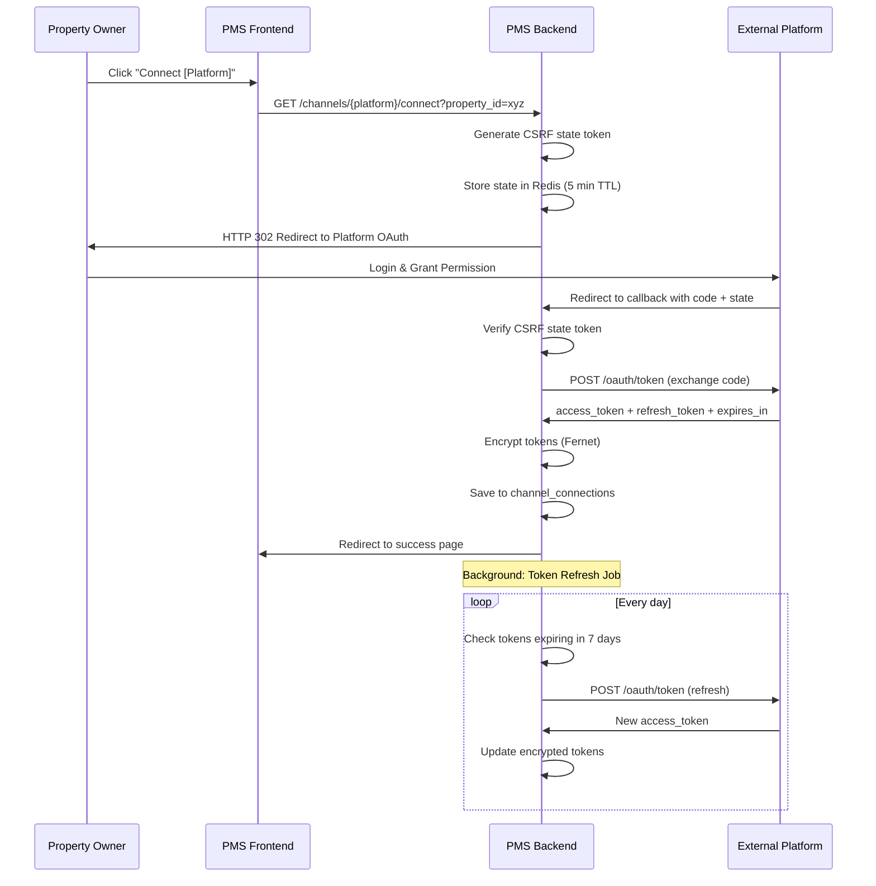

# OAuth 2.0 Integration Flows

## Overview

This document details the OAuth 2.0 implementation for all 5 booking platforms supported by the PMS-Webapp Channel Manager. Each platform has its own OAuth flow, scopes, and token management requirements.

---

## 1. OAuth Flow Architecture

### 1.1 Universal OAuth Endpoints

```python
# FastAPI OAuth Routes
from fastapi import APIRouter, HTTPException, Query, Depends
from fastapi.responses import RedirectResponse

router = APIRouter(prefix="/api/v1/channels", tags=["Channel OAuth"])

# Initiate OAuth flow
@router.get("/{channel_type}/connect")
async def initiate_oauth(
    channel_type: ChannelType,
    property_id: UUID = Query(...),
    user: User = Depends(get_current_user)
) -> RedirectResponse:
    """
    Initiate OAuth flow for a specific channel.
    Redirects user to platform's OAuth consent page.
    """
    pass

# OAuth callback (receives auth code)
@router.get("/{channel_type}/callback")
async def oauth_callback(
    channel_type: ChannelType,
    code: str = Query(...),
    state: str = Query(...),
    error: Optional[str] = Query(None)
) -> RedirectResponse:
    """
    Handle OAuth callback from platform.
    Exchanges code for tokens and saves to database.
    """
    pass

# Refresh token (background job or manual)
@router.post("/connections/{connection_id}/refresh-token")
async def refresh_token(
    connection_id: UUID,
    user: User = Depends(get_current_user)
) -> dict:
    """
    Manually trigger token refresh for a connection.
    """
    pass

# Disconnect channel
@router.delete("/connections/{connection_id}")
async def disconnect_channel(
    connection_id: UUID,
    user: User = Depends(get_current_user)
) -> dict:
    """
    Revoke tokens and disconnect channel.
    """
    pass
```

### 1.2 Generic OAuth Flow Diagram



---

## 2. Platform-Specific OAuth Implementations

### 2.1 Airbnb

**OAuth Type:** Authorization Code Flow

**Configuration:**
```python
AIRBNB_OAUTH_CONFIG = {
    "client_id": os.getenv("AIRBNB_CLIENT_ID"),
    "client_secret": os.getenv("AIRBNB_CLIENT_SECRET"),
    "authorize_url": "https://www.airbnb.com/oauth2/auth",
    "token_url": "https://api.airbnb.com/v2/oauth2/authorizations",
    "redirect_uri": f"{BASE_URL}/api/v1/channels/airbnb/callback",
    "scopes": [
        "listings:read",
        "listings:write",
        "reservations:read",
        "reservations:write",
        "calendar:read",
        "calendar:write"
    ],
    "token_expiry_days": 365,  # Airbnb tokens last ~1 year
    "refresh_buffer_days": 30   # Refresh 30 days before expiry
}
```

**Authorization URL Construction:**
```python
def build_airbnb_auth_url(property_id: UUID, state: str) -> str:
    params = {
        "client_id": AIRBNB_OAUTH_CONFIG["client_id"],
        "redirect_uri": AIRBNB_OAUTH_CONFIG["redirect_uri"],
        "scope": " ".join(AIRBNB_OAUTH_CONFIG["scopes"]),
        "response_type": "code",
        "state": state  # Contains encrypted property_id + CSRF
    }
    return f"{AIRBNB_OAUTH_CONFIG['authorize_url']}?{urlencode(params)}"
```

**Token Exchange:**
```python
async def exchange_airbnb_code(code: str) -> dict:
    async with httpx.AsyncClient() as client:
        response = await client.post(
            AIRBNB_OAUTH_CONFIG["token_url"],
            data={
                "client_id": AIRBNB_OAUTH_CONFIG["client_id"],
                "client_secret": AIRBNB_OAUTH_CONFIG["client_secret"],
                "code": code,
                "grant_type": "authorization_code",
                "redirect_uri": AIRBNB_OAUTH_CONFIG["redirect_uri"]
            }
        )
        response.raise_for_status()
        return response.json()
        # Returns: {access_token, refresh_token, expires_in, user_id}
```

**Token Refresh:**
```python
async def refresh_airbnb_token(refresh_token: str) -> dict:
    async with httpx.AsyncClient() as client:
        response = await client.post(
            AIRBNB_OAUTH_CONFIG["token_url"],
            data={
                "client_id": AIRBNB_OAUTH_CONFIG["client_id"],
                "client_secret": AIRBNB_OAUTH_CONFIG["client_secret"],
                "refresh_token": refresh_token,
                "grant_type": "refresh_token"
            }
        )
        response.raise_for_status()
        return response.json()
```

**Webhook Registration:**
```python
async def register_airbnb_webhooks(access_token: str, listing_id: str) -> None:
    webhook_url = f"{BASE_URL}/api/v1/webhooks/airbnb"

    async with httpx.AsyncClient() as client:
        await client.post(
            "https://api.airbnb.com/v2/webhooks",
            headers={"Authorization": f"Bearer {access_token}"},
            json={
                "url": webhook_url,
                "listing_id": listing_id,
                "events": [
                    "reservation.created",
                    "reservation.updated",
                    "reservation.cancelled"
                ]
            }
        )
```

---

### 2.2 Booking.com

**OAuth Type:** OAuth 2.0 (Authorization Code) or Basic Auth (legacy)

**Configuration:**
```python
BOOKING_COM_OAUTH_CONFIG = {
    "client_id": os.getenv("BOOKING_COM_CLIENT_ID"),
    "client_secret": os.getenv("BOOKING_COM_CLIENT_SECRET"),
    "authorize_url": "https://account.booking.com/oauth2/authorize",
    "token_url": "https://account.booking.com/oauth2/token",
    "redirect_uri": f"{BASE_URL}/api/v1/channels/booking_com/callback",
    "scopes": [
        "properties.read",
        "reservations.read",
        "reservations.write",
        "availability.write"
    ],
    "token_expiry_hours": 1,  # Short-lived tokens
    "refresh_token_expiry_days": 30
}
```

**Authorization URL Construction:**
```python
def build_booking_com_auth_url(property_id: UUID, state: str) -> str:
    params = {
        "client_id": BOOKING_COM_OAUTH_CONFIG["client_id"],
        "redirect_uri": BOOKING_COM_OAUTH_CONFIG["redirect_uri"],
        "scope": " ".join(BOOKING_COM_OAUTH_CONFIG["scopes"]),
        "response_type": "code",
        "state": state,
        "access_type": "offline"  # Required for refresh token
    }
    return f"{BOOKING_COM_OAUTH_CONFIG['authorize_url']}?{urlencode(params)}"
```

**Token Exchange:**
```python
async def exchange_booking_com_code(code: str) -> dict:
    async with httpx.AsyncClient() as client:
        response = await client.post(
            BOOKING_COM_OAUTH_CONFIG["token_url"],
            data={
                "client_id": BOOKING_COM_OAUTH_CONFIG["client_id"],
                "client_secret": BOOKING_COM_OAUTH_CONFIG["client_secret"],
                "code": code,
                "grant_type": "authorization_code",
                "redirect_uri": BOOKING_COM_OAUTH_CONFIG["redirect_uri"]
            },
            headers={"Content-Type": "application/x-www-form-urlencoded"}
        )
        response.raise_for_status()
        return response.json()
```

**Push Notification Setup:**
```python
# Booking.com uses push notifications instead of webhooks
# Property owner configures PMS endpoint in their Booking.com extranet

BOOKING_COM_PUSH_ENDPOINT = f"{BASE_URL}/api/v1/webhooks/booking_com"

# Notifications are received at this endpoint for:
# - New reservations
# - Reservation modifications
# - Reservation cancellations
```

---

### 2.3 Expedia (Vrbo Parent Company)

**OAuth Type:** Client Credentials Flow (server-to-server)

**Configuration:**
```python
EXPEDIA_OAUTH_CONFIG = {
    "client_id": os.getenv("EXPEDIA_CLIENT_ID"),
    "client_secret": os.getenv("EXPEDIA_CLIENT_SECRET"),
    "token_url": "https://api.expediagroup.com/identity/oauth2/v3/token",
    "api_base_url": "https://services.expediapartnercentral.com",
    "scopes": [
        "property.read",
        "property.write",
        "reservations.read",
        "reservations.write"
    ],
    "token_expiry_hours": 1
}
```

**Token Acquisition (Client Credentials):**
```python
async def get_expedia_access_token() -> str:
    """
    Expedia uses Client Credentials flow - no user authorization needed.
    Tokens are short-lived and should be cached.
    """
    # Check cache first
    cached_token = await redis.get("expedia:access_token")
    if cached_token:
        return cached_token.decode()

    async with httpx.AsyncClient() as client:
        response = await client.post(
            EXPEDIA_OAUTH_CONFIG["token_url"],
            data={
                "grant_type": "client_credentials",
                "scope": " ".join(EXPEDIA_OAUTH_CONFIG["scopes"])
            },
            auth=(
                EXPEDIA_OAUTH_CONFIG["client_id"],
                EXPEDIA_OAUTH_CONFIG["client_secret"]
            )
        )
        response.raise_for_status()
        data = response.json()

        # Cache token with buffer before expiry
        expires_in = data["expires_in"] - 60  # 1 minute buffer
        await redis.setex(
            "expedia:access_token",
            expires_in,
            data["access_token"]
        )

        return data["access_token"]
```

**Property Linking:**
```python
# Expedia requires property linking via their partner portal
# Once linked, property_id is stored in channel_connections.channel_property_id

async def link_expedia_property(
    property_id: UUID,
    expedia_property_id: str
) -> ChannelConnection:
    """
    Create channel connection after property is linked in Expedia portal.
    """
    connection = await db.execute(
        insert(channel_connections).values(
            tenant_id=get_current_tenant_id(),
            property_id=property_id,
            channel_type="expedia",
            channel_property_id=expedia_property_id,
            status="active",
            sync_enabled=True,
            connected_at=datetime.utcnow()
        ).returning(channel_connections)
    )
    return connection.first()
```

---

### 2.4 FeWo-direkt (Vrbo Germany)

**OAuth Type:** OAuth 2.0 Authorization Code Flow

**Configuration:**
```python
FEWO_DIREKT_OAUTH_CONFIG = {
    "client_id": os.getenv("FEWO_DIREKT_CLIENT_ID"),
    "client_secret": os.getenv("FEWO_DIREKT_CLIENT_SECRET"),
    "authorize_url": "https://ws.homeaway.com/oauth/authorize",
    "token_url": "https://ws.homeaway.com/oauth/token",
    "redirect_uri": f"{BASE_URL}/api/v1/channels/fewo_direkt/callback",
    "api_base_url": "https://api.vrbo.com/v2",
    "scopes": [
        "listing:read",
        "listing:write",
        "reservation:read",
        "reservation:write",
        "calendar:read",
        "calendar:write"
    ],
    "token_expiry_hours": 24
}
```

**Authorization URL Construction:**
```python
def build_fewo_direkt_auth_url(property_id: UUID, state: str) -> str:
    params = {
        "client_id": FEWO_DIREKT_OAUTH_CONFIG["client_id"],
        "redirect_uri": FEWO_DIREKT_OAUTH_CONFIG["redirect_uri"],
        "scope": " ".join(FEWO_DIREKT_OAUTH_CONFIG["scopes"]),
        "response_type": "code",
        "state": state
    }
    return f"{FEWO_DIREKT_OAUTH_CONFIG['authorize_url']}?{urlencode(params)}"
```

**Token Exchange:**
```python
async def exchange_fewo_direkt_code(code: str) -> dict:
    async with httpx.AsyncClient() as client:
        response = await client.post(
            FEWO_DIREKT_OAUTH_CONFIG["token_url"],
            data={
                "client_id": FEWO_DIREKT_OAUTH_CONFIG["client_id"],
                "client_secret": FEWO_DIREKT_OAUTH_CONFIG["client_secret"],
                "code": code,
                "grant_type": "authorization_code",
                "redirect_uri": FEWO_DIREKT_OAUTH_CONFIG["redirect_uri"]
            }
        )
        response.raise_for_status()
        return response.json()
```

**Webhook Registration:**
```python
async def register_fewo_direkt_webhooks(
    access_token: str,
    listing_id: str
) -> None:
    webhook_url = f"{BASE_URL}/api/v1/webhooks/fewo_direkt"

    async with httpx.AsyncClient() as client:
        # Register for reservation events
        await client.post(
            f"{FEWO_DIREKT_OAUTH_CONFIG['api_base_url']}/webhooks",
            headers={"Authorization": f"Bearer {access_token}"},
            json={
                "url": webhook_url,
                "listingId": listing_id,
                "events": [
                    "RESERVATION_CREATED",
                    "RESERVATION_MODIFIED",
                    "RESERVATION_CANCELLED",
                    "INSTANT_BOOK_CREATED"
                ]
            }
        )
```

---

### 2.5 Google Vacation Rentals

**OAuth Type:** Service Account (preferred) or OAuth 2.0

**Configuration:**
```python
GOOGLE_VR_CONFIG = {
    "project_id": os.getenv("GOOGLE_CLOUD_PROJECT_ID"),
    "service_account_file": os.getenv("GOOGLE_SERVICE_ACCOUNT_FILE"),
    "api_base_url": "https://travelpartner.googleapis.com/v3",
    "scopes": [
        "https://www.googleapis.com/auth/travelpartner"
    ],
    # For OAuth 2.0 alternative:
    "client_id": os.getenv("GOOGLE_CLIENT_ID"),
    "client_secret": os.getenv("GOOGLE_CLIENT_SECRET"),
    "authorize_url": "https://accounts.google.com/o/oauth2/v2/auth",
    "token_url": "https://oauth2.googleapis.com/token",
    "redirect_uri": f"{BASE_URL}/api/v1/channels/google/callback"
}
```

**Service Account Authentication (Recommended):**
```python
from google.oauth2 import service_account
from google.auth.transport.requests import Request

async def get_google_access_token() -> str:
    """
    Get access token using service account credentials.
    """
    credentials = service_account.Credentials.from_service_account_file(
        GOOGLE_VR_CONFIG["service_account_file"],
        scopes=GOOGLE_VR_CONFIG["scopes"]
    )

    # Refresh credentials if expired
    if not credentials.valid:
        credentials.refresh(Request())

    return credentials.token
```

**OAuth 2.0 Flow (Alternative):**
```python
def build_google_auth_url(property_id: UUID, state: str) -> str:
    params = {
        "client_id": GOOGLE_VR_CONFIG["client_id"],
        "redirect_uri": GOOGLE_VR_CONFIG["redirect_uri"],
        "scope": " ".join(GOOGLE_VR_CONFIG["scopes"]),
        "response_type": "code",
        "state": state,
        "access_type": "offline",
        "prompt": "consent"  # Force consent to get refresh token
    }
    return f"{GOOGLE_VR_CONFIG['authorize_url']}?{urlencode(params)}"

async def exchange_google_code(code: str) -> dict:
    async with httpx.AsyncClient() as client:
        response = await client.post(
            GOOGLE_VR_CONFIG["token_url"],
            data={
                "client_id": GOOGLE_VR_CONFIG["client_id"],
                "client_secret": GOOGLE_VR_CONFIG["client_secret"],
                "code": code,
                "grant_type": "authorization_code",
                "redirect_uri": GOOGLE_VR_CONFIG["redirect_uri"]
            }
        )
        response.raise_for_status()
        return response.json()
```

**Hotel Center Linking:**
```python
# Google Vacation Rentals requires property setup in Hotel Center
# Property is linked via partner ID

async def setup_google_vr_property(
    property_id: UUID,
    hotel_center_id: str
) -> ChannelConnection:
    """
    Create channel connection for Google VR after Hotel Center setup.
    """
    return await db.execute(
        insert(channel_connections).values(
            tenant_id=get_current_tenant_id(),
            property_id=property_id,
            channel_type="google",
            channel_property_id=hotel_center_id,
            status="active",
            sync_enabled=True
        ).returning(channel_connections)
    )
```

---

## 3. Token Management

### 3.1 Token Encryption

```python
from cryptography.fernet import Fernet
import os

class TokenManager:
    """Secure token storage and retrieval."""

    def __init__(self):
        key = os.getenv("TOKEN_ENCRYPTION_KEY")
        if not key:
            raise ValueError("TOKEN_ENCRYPTION_KEY not configured")
        self.fernet = Fernet(key.encode())

    def encrypt_token(self, token: str) -> str:
        """Encrypt a token for storage."""
        return self.fernet.encrypt(token.encode()).decode()

    def decrypt_token(self, encrypted: str) -> str:
        """Decrypt a stored token."""
        return self.fernet.decrypt(encrypted.encode()).decode()

    async def save_tokens(
        self,
        connection_id: UUID,
        access_token: str,
        refresh_token: str,
        expires_at: datetime
    ) -> None:
        """Save encrypted tokens to database."""
        await db.execute(
            update(channel_connections)
            .where(channel_connections.id == connection_id)
            .values(
                access_token_encrypted=self.encrypt_token(access_token),
                refresh_token_encrypted=self.encrypt_token(refresh_token),
                token_expires_at=expires_at,
                status="active",
                error_message=None,
                error_count=0
            )
        )

    async def get_access_token(self, connection_id: UUID) -> str:
        """Get decrypted access token, refreshing if needed."""
        conn = await db.get(channel_connections, connection_id)

        # Check if token is expired or expiring soon
        if conn.token_expires_at < datetime.utcnow() + timedelta(minutes=5):
            await self.refresh_token(connection_id)
            conn = await db.get(channel_connections, connection_id)

        return self.decrypt_token(conn.access_token_encrypted)
```

### 3.2 Token Refresh Background Job

```python
from celery import Celery
from celery.schedules import crontab

celery = Celery("channel_manager")

# Schedule token refresh check every hour
celery.conf.beat_schedule = {
    "refresh-expiring-tokens": {
        "task": "channel_manager.tasks.refresh_expiring_tokens",
        "schedule": crontab(minute=0),  # Every hour at minute 0
    }
}

@celery.task
async def refresh_expiring_tokens():
    """
    Refresh tokens that are expiring within the next 7 days.
    Run hourly to ensure tokens are always valid.
    """
    # Get connections with tokens expiring soon
    expiring_connections = await db.query(channel_connections).where(
        and_(
            channel_connections.token_expires_at < datetime.utcnow() + timedelta(days=7),
            channel_connections.status == "active",
            channel_connections.refresh_token_encrypted.isnot(None)
        )
    ).all()

    results = {"success": 0, "failed": 0, "errors": []}

    for conn in expiring_connections:
        try:
            await refresh_single_token(conn.id)
            results["success"] += 1

            # Log successful refresh
            await log_sync_event(
                connection_id=conn.id,
                sync_type="token_refresh",
                direction="outbound",
                status="success"
            )

        except Exception as e:
            results["failed"] += 1
            results["errors"].append({
                "connection_id": str(conn.id),
                "channel_type": conn.channel_type,
                "error": str(e)
            })

            # Update connection status on repeated failures
            await db.execute(
                update(channel_connections)
                .where(channel_connections.id == conn.id)
                .values(
                    error_count=channel_connections.error_count + 1,
                    last_error_at=datetime.utcnow(),
                    error_message=str(e)
                )
            )

            # Alert if token refresh fails repeatedly
            if conn.error_count >= 3:
                await send_token_refresh_alert(conn)

    return results


async def refresh_single_token(connection_id: UUID) -> None:
    """Refresh token for a single connection."""
    conn = await db.get(channel_connections, connection_id)
    token_manager = TokenManager()
    refresh_token = token_manager.decrypt_token(conn.refresh_token_encrypted)

    # Call platform-specific refresh
    if conn.channel_type == "airbnb":
        new_tokens = await refresh_airbnb_token(refresh_token)
    elif conn.channel_type == "booking_com":
        new_tokens = await refresh_booking_com_token(refresh_token)
    elif conn.channel_type == "fewo_direkt":
        new_tokens = await refresh_fewo_direkt_token(refresh_token)
    elif conn.channel_type == "google":
        new_tokens = await refresh_google_token(refresh_token)
    else:
        raise ValueError(f"Unknown channel type: {conn.channel_type}")

    # Save new tokens
    expires_at = datetime.utcnow() + timedelta(seconds=new_tokens["expires_in"])
    await token_manager.save_tokens(
        connection_id=connection_id,
        access_token=new_tokens["access_token"],
        refresh_token=new_tokens.get("refresh_token", refresh_token),  # May not be returned
        expires_at=expires_at
    )
```

---

## 4. CSRF Protection

### 4.1 State Token Generation

```python
import secrets
import json
from base64 import urlsafe_b64encode, urlsafe_b64decode

class OAuthStateManager:
    """Manage OAuth state tokens for CSRF protection."""

    def __init__(self, redis_client):
        self.redis = redis_client
        self.state_ttl = 300  # 5 minutes

    async def generate_state(
        self,
        property_id: UUID,
        tenant_id: UUID,
        user_id: UUID
    ) -> str:
        """Generate a secure state token containing context."""
        # Create state payload
        payload = {
            "property_id": str(property_id),
            "tenant_id": str(tenant_id),
            "user_id": str(user_id),
            "csrf": secrets.token_urlsafe(32),
            "created_at": datetime.utcnow().isoformat()
        }

        # Encode payload
        state = urlsafe_b64encode(json.dumps(payload).encode()).decode()

        # Store in Redis for verification
        await self.redis.setex(
            f"oauth_state:{state}",
            self.state_ttl,
            json.dumps(payload)
        )

        return state

    async def verify_state(self, state: str) -> dict:
        """Verify state token and return payload."""
        # Check if state exists in Redis
        stored = await self.redis.get(f"oauth_state:{state}")
        if not stored:
            raise HTTPException(
                status_code=400,
                detail="Invalid or expired state token"
            )

        # Delete state (one-time use)
        await self.redis.delete(f"oauth_state:{state}")

        # Decode and return payload
        return json.loads(stored)
```

### 4.2 Callback Verification

```python
@router.get("/{channel_type}/callback")
async def oauth_callback(
    channel_type: ChannelType,
    code: str = Query(None),
    state: str = Query(...),
    error: str = Query(None),
    error_description: str = Query(None)
):
    """Handle OAuth callback with CSRF verification."""
    # Check for OAuth errors
    if error:
        logger.error(f"OAuth error: {error} - {error_description}")
        return RedirectResponse(
            f"/settings/channels?error={error}&message={error_description}"
        )

    # Verify state token
    state_manager = OAuthStateManager(redis)
    try:
        state_payload = await state_manager.verify_state(state)
    except HTTPException:
        return RedirectResponse(
            "/settings/channels?error=invalid_state"
        )

    # Exchange code for tokens
    try:
        tokens = await exchange_code_for_tokens(channel_type, code)
    except httpx.HTTPError as e:
        logger.error(f"Token exchange failed: {e}")
        return RedirectResponse(
            f"/settings/channels?error=token_exchange_failed"
        )

    # Create or update channel connection
    await create_channel_connection(
        channel_type=channel_type,
        property_id=UUID(state_payload["property_id"]),
        tenant_id=UUID(state_payload["tenant_id"]),
        tokens=tokens
    )

    return RedirectResponse(
        f"/settings/channels?success=true&channel={channel_type}"
    )
```

---

## 5. Error Handling

### 5.1 OAuth Error Types

| Error | Description | Recovery Action |
|-------|-------------|-----------------|
| `access_denied` | User denied permission | Inform user, no retry |
| `invalid_grant` | Code expired or already used | Restart OAuth flow |
| `invalid_client` | Wrong client credentials | Alert admin, check config |
| `invalid_scope` | Requested invalid scope | Check scope configuration |
| `server_error` | Platform server error | Retry with backoff |
| `temporarily_unavailable` | Platform overloaded | Retry after delay |

### 5.2 Error Handling Implementation

```python
class OAuthError(Exception):
    """Base exception for OAuth errors."""
    def __init__(self, error_code: str, message: str, recoverable: bool = False):
        self.error_code = error_code
        self.message = message
        self.recoverable = recoverable
        super().__init__(message)


async def handle_oauth_error(
    connection_id: UUID,
    error: OAuthError
) -> None:
    """Handle OAuth errors with appropriate actions."""
    if error.error_code == "invalid_grant":
        # Refresh token is invalid, mark connection as disconnected
        await db.execute(
            update(channel_connections)
            .where(channel_connections.id == connection_id)
            .values(
                status="disconnected",
                error_message="Authorization expired. Please reconnect.",
                disconnected_at=datetime.utcnow()
            )
        )
        # Notify property owner
        await send_reconnect_notification(connection_id)

    elif error.error_code == "temporarily_unavailable":
        # Temporary error, retry later
        await db.execute(
            update(channel_connections)
            .where(channel_connections.id == connection_id)
            .values(
                error_message=error.message,
                error_count=channel_connections.error_count + 1,
                last_error_at=datetime.utcnow()
            )
        )

    else:
        # Unknown error, log and alert
        logger.error(f"OAuth error for connection {connection_id}: {error}")
        await send_admin_alert(
            f"OAuth error: {error.error_code}",
            details={"connection_id": str(connection_id), "error": error.message}
        )
```

---

## 6. Security Best Practices

### 6.1 Token Storage

- **Never log tokens**: Use `structlog` with token scrubbing
- **Encrypt at rest**: Fernet encryption with environment-based key
- **Minimal token lifetime**: Prefer short-lived access tokens
- **Secure refresh tokens**: Store encrypted, never expose to frontend

### 6.2 Environment Variables

```bash
# Required environment variables for OAuth
AIRBNB_CLIENT_ID=your_airbnb_client_id
AIRBNB_CLIENT_SECRET=your_airbnb_client_secret
BOOKING_COM_CLIENT_ID=your_booking_com_client_id
BOOKING_COM_CLIENT_SECRET=your_booking_com_client_secret
EXPEDIA_CLIENT_ID=your_expedia_client_id
EXPEDIA_CLIENT_SECRET=your_expedia_client_secret
FEWO_DIREKT_CLIENT_ID=your_fewo_direkt_client_id
FEWO_DIREKT_CLIENT_SECRET=your_fewo_direkt_client_secret
GOOGLE_CLIENT_ID=your_google_client_id
GOOGLE_CLIENT_SECRET=your_google_client_secret
GOOGLE_SERVICE_ACCOUNT_FILE=/path/to/service-account.json

# Token encryption key (generate with: python -c "from cryptography.fernet import Fernet; print(Fernet.generate_key().decode())")
TOKEN_ENCRYPTION_KEY=your_fernet_key_here
```

### 6.3 Audit Logging

```python
async def log_oauth_event(
    connection_id: UUID,
    event_type: str,
    details: dict
) -> None:
    """Log OAuth events for audit trail."""
    await db.execute(
        insert(audit_log).values(
            tenant_id=get_current_tenant_id(),
            entity_type="channel_connection",
            entity_id=connection_id,
            action=event_type,
            new_data={
                "event": event_type,
                "details": details,
                "timestamp": datetime.utcnow().isoformat()
            },
            user_id=get_current_user_id()
        )
    )
```

---

## 7. Testing OAuth Flows

### 7.1 Unit Tests

```python
import pytest
from unittest.mock import AsyncMock, patch

@pytest.mark.asyncio
async def test_airbnb_token_exchange():
    """Test Airbnb OAuth token exchange."""
    mock_response = {
        "access_token": "test_access_token",
        "refresh_token": "test_refresh_token",
        "expires_in": 3600,
        "user_id": "12345"
    }

    with patch("httpx.AsyncClient.post", new_callable=AsyncMock) as mock_post:
        mock_post.return_value.json.return_value = mock_response
        mock_post.return_value.raise_for_status = lambda: None

        result = await exchange_airbnb_code("test_code")

        assert result["access_token"] == "test_access_token"
        assert result["refresh_token"] == "test_refresh_token"


@pytest.mark.asyncio
async def test_state_verification():
    """Test OAuth state CSRF protection."""
    redis_mock = AsyncMock()
    state_manager = OAuthStateManager(redis_mock)

    # Valid state should return payload
    redis_mock.get.return_value = json.dumps({
        "property_id": "123",
        "tenant_id": "456",
        "user_id": "789",
        "csrf": "token"
    })

    result = await state_manager.verify_state("valid_state")
    assert result["property_id"] == "123"

    # Invalid state should raise exception
    redis_mock.get.return_value = None
    with pytest.raises(HTTPException):
        await state_manager.verify_state("invalid_state")
```

### 7.2 Integration Tests

```python
@pytest.mark.integration
async def test_full_oauth_flow(test_client, test_db):
    """Test complete OAuth flow end-to-end."""
    # 1. Initiate OAuth
    response = await test_client.get(
        "/api/v1/channels/airbnb/connect",
        params={"property_id": test_property_id},
        follow_redirects=False
    )
    assert response.status_code == 302
    assert "airbnb.com/oauth2/auth" in response.headers["location"]

    # 2. Simulate callback
    # (In real tests, use a mock OAuth server)
```

---

*Document Version: 1.0.0*
*Last Updated: 2024-12-21*
*Author: channel-manager-architect*
