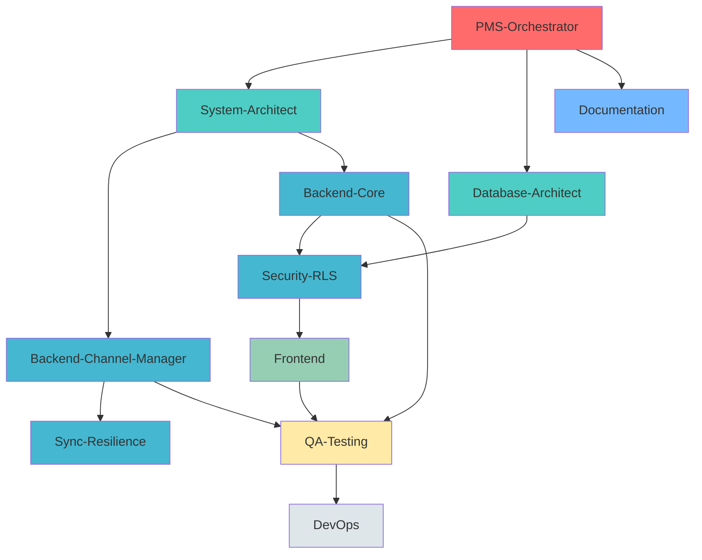

# PMS-Webapp Multi-Agent System

**Projektname:** PMS-Webapp
**Projektziel:** All-in-One Buchungssoftware für Ferienwohnungen mit integriertem Channel Manager

## Projektziel im Detail

Entwicklung einer Property Management System (PMS) Webapp, die als zentrale Buchungsplattform für Ferienwohnungen dient. Der Kern ist ein **Channel Manager**, der Verfügbarkeiten und Preise in Echtzeit mit folgenden Plattformen synchronisiert:

- **Airbnb**
- **Booking.com**
- **Expedia**
- **FeWo-direkt**
- **Google Ferienunterkünfte**

**Hauptziel:** Vermeidung von Doppelbuchungen durch bidirektionale Echtzeit-Synchronisation.

---

## Agenten-Hierarchie

### Master-Agent: PMS-Orchestrator
**Rolle:** Gesamtkoordination und Projektsteuerung
**Model:** opus
**Verantwortung:**
- Orchestrierung aller Sub-Agents
- Abhängigkeitsmanagement zwischen Agents
- Qualitätssicherung über alle Phasen
- Stakeholder-Kommunikation
- Eskalationsmanagement

**Prompt-File:** `agents/pms-orchestrator.md`

---

### Sub-Agents (Spezialisiert)

#### 1. System-Architect-Agent
**Rolle:** Gesamtarchitektur, Technologie-Stack, Systemdesign
**Model:** opus
**Phase:** 1 (Architektur)
**Prompt-File:** `agents/system-architect.md`

#### 2. Database-Architect-Agent
**Rolle:** Datenmodellierung, Supabase-Setup, RLS-Policies
**Model:** opus
**Phase:** 1 (Architektur)
**Prompt-File:** `agents/database-architect-pms.md`

#### 3. Backend-Channel-Manager-Agent
**Rolle:** Channel-Manager-API-Integration, Sync-Logik, Rate-Limiting
**Model:** opus
**Phase:** 2 (Backend-Implementierung)
**Prompt-File:** `agents/backend-channel-manager.md`

#### 4. Sync-Resilience-Agent
**Rolle:** Fehlerbehandlung, Retry-Logic, Conflict-Resolution, Idempotenz
**Model:** opus
**Phase:** 2 (Backend-Implementierung)
**Prompt-File:** `agents/sync-resilience.md`

#### 5. Backend-Core-Agent
**Rolle:** PMS-Core-Features (Buchungen, Kalender, Gäste, Finanzen)
**Model:** inherit
**Phase:** 2 (Backend-Implementierung)
**Prompt-File:** `agents/backend-core-pms.md`

#### 6. Security-RLS-Agent
**Rolle:** Row-Level-Security (RLS), Multi-Tenancy, Auth-Patterns
**Model:** opus
**Phase:** 2 (Backend-Implementierung)
**Prompt-File:** `agents/security-rls.md`

#### 7. Frontend-Agent
**Rolle:** UI/UX für PMS-Dashboard, Kalenderansichten, Buchungsflows
**Model:** inherit
**Phase:** 3 (Frontend-Implementierung)
**Prompt-File:** `agents/frontend-pms.md`

#### 8. QA-Testing-Agent
**Rolle:** Test-Strategien, Integration-Tests, E2E-Tests für Sync-Szenarien
**Model:** sonnet
**Phase:** 4 (Testing & QA)
**Prompt-File:** `agents/qa-testing-pms.md`

#### 9. DevOps-Agent
**Rolle:** Deployment, CI/CD, Monitoring, Observability für Sync-Prozesse
**Model:** sonnet
**Phase:** 5 (Deployment)
**Prompt-File:** `agents/devops-pms.md`

#### 10. Documentation-Agent
**Rolle:** Technische Dokumentation, API-Docs, Stakeholder-PRD
**Model:** sonnet
**Phase:** 6 (Dokumentation)
**Prompt-File:** `agents/documentation-pms.md`

---

## Entwicklungsreihenfolge & Phasen

### Phase 1: Architektur & Design (Ultra-Technisch)
**Agents:** System-Architect, Database-Architect
**Dauer:** Bis alle architektonischen Entscheidungen getroffen sind
**Output:**
- System-Architektur-Diagramme (C4-Model)
- Technologie-Stack-Entscheidungen
- Datenmodell (ERD, RLS-Policies)
- API-Spezifikationen (OpenAPI)
- Sync-Workflow-Diagramme
- Failure-Mode-Analysen

### Phase 2: Backend-Implementierung
**Agents:** Backend-Channel-Manager, Sync-Resilience, Backend-Core, Security-RLS
**Dauer:** Iterativ, Feature-basiert
**Output:**
- Channel-Manager-Integrationen (APIs für Airbnb, Booking.com, etc.)
- Sync-Engine mit Conflict-Resolution
- Core-PMS-Features (Buchungen, Kalender, Gäste)
- RLS-Policies in Supabase
- Unit-Tests & Integration-Tests

### Phase 3: Frontend-Implementierung
**Agents:** Frontend
**Dauer:** Parallel zu Backend Phase 2 (ab API-Spezifikationen verfügbar)
**Output:**
- PMS-Dashboard
- Kalenderansichten (Multi-Property)
- Buchungsverwaltung
- Channel-Manager-Status-Übersicht
- Responsive Design

### Phase 4: Testing & QA
**Agents:** QA-Testing
**Dauer:** Kontinuierlich ab Phase 2
**Output:**
- Test-Suites (Unit, Integration, E2E)
- Sync-Szenarien-Tests (Doppelbuchung-Verhinderung)
- Performance-Tests (API-Rate-Limits)
- Security-Audits

### Phase 5: Deployment & Observability
**Agents:** DevOps
**Dauer:** Kontinuierlich ab Phase 2
**Output:**
- CI/CD-Pipelines
- Monitoring-Dashboards (Grafana)
- Alerting-Rules (Sync-Failures)
- Incident-Response-Runbooks

### Phase 6: Dokumentation
**Agents:** Documentation
**Dauer:** Kontinuierlich, finalisiert am Ende
**Output:**
- PRD / Pflichtenheft (für Stakeholder)
- Technische Architektur-Dokumentation
- API-Dokumentation
- Betriebshandbücher

---

## Agenten-Kommunikation & Übergaben

### Kritische Übergaben

| Von Agent | An Agent | Artefakt | Format |
|-----------|----------|----------|--------|
| System-Architect | Database-Architect | System-Requirements | Markdown + Mermaid |
| Database-Architect | Backend-Channel-Manager | Datenmodell, RLS-Schema | ERD, SQL-Scripts |
| System-Architect | Backend-Channel-Manager | API-Spezifikation | OpenAPI 3.1 |
| Backend-Channel-Manager | Sync-Resilience | Sync-Workflows | Mermaid-Diagramme |
| Backend-Core | Security-RLS | Daten-Zugriffsmuster | Code + Policies |
| Backend-Channel-Manager | Frontend | API-Contracts | OpenAPI, TypeScript-Types |
| Backend-Core | QA-Testing | Feature-Spezifikationen | Gherkin/BDD |
| QA-Testing | DevOps | Test-Reports | JSON, HTML |
| DevOps | Documentation | System-Metriken | Prometheus-Metrics |

---

## Qualitätskriterien (System-weit)

### Architektur-Phase
- [ ] C4-Diagramme vollständig (Context, Container, Component, Code)
- [ ] Alle Technologie-Entscheidungen dokumentiert (ADRs)
- [ ] Failure-Mode-Analysis für jeden Sync-Kanal
- [ ] Datenmodell in 3NF (normalisiert)
- [ ] RLS-Policies für alle sensiblen Tabellen

### Backend-Phase
- [ ] OpenAPI 3.1 Spezifikation generiert und validiert
- [ ] 100% Code-Coverage für Sync-Engine
- [ ] Idempotenz-Tests für alle Channel-Manager-Operationen
- [ ] Rate-Limiting implementiert (pro Kanal)
- [ ] Circuit-Breaker für alle externen APIs

### Frontend-Phase
- [ ] WCAG 2.1 AA Compliance
- [ ] Lighthouse Score > 90 (Performance, Accessibility)
- [ ] Mobile-First Responsive Design
- [ ] Offline-Fallback für kritische Features

### Testing-Phase
- [ ] Unit-Test-Coverage > 80%
- [ ] Integration-Tests für alle Sync-Szenarien
- [ ] E2E-Tests für kritische User-Journeys
- [ ] Chaos-Testing für Sync-Resilience

### Deployment-Phase
- [ ] Zero-Downtime Deployment
- [ ] Automated Rollback-Mechanismen
- [ ] Distributed Tracing implementiert (OpenTelemetry)
- [ ] SLOs definiert (99.9% Uptime für Sync-Engine)

---

## Done-Definitionen (Pro Agent)

Siehe `workflows/done-definitions.md` für detaillierte Checklisten.

---

## Workflow-Sequenz

Siehe `workflows/development-sequence.md` für die vollständige Entwicklungsreihenfolge mit Checkpoints.

---

## Skills-Integration

Folgende Agent-Skills werden automatisch aktiviert:

### Backend-Development
- `api-design-principles`
- `architecture-patterns`
- `microservices-patterns`

### Database
- `sql-optimization-patterns`

### Security
- `sast-configuration`
- `stride-analysis-patterns`

### DevOps
- `github-actions-templates`
- `deployment-pipeline-design`

### Observability
- `distributed-tracing`
- `prometheus-configuration`

---

**Erstellt:** 2025-12-21
**Version:** 1.0
**Projekt:** PMS-Webapp
