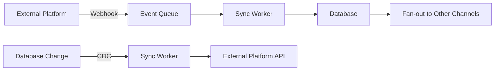

# PMS-Webapp

All-in-One Buchungssoftware für Ferienwohnungen (PMS) mit Direct Booking Engine und integriertem Channel Manager.

## Status
**Frozen v1.0** (Phasen 1–10A abgeschlossen: Architektur, DB/RLS, Backend, Security Fixes, PRD, Release-Plan, UI/UX-Konzeption)

## Core Principles (fix)
- PMS-Core = Single Source of Truth
- Direct Booking ist gleichwertig zu Channel Bookings
- Event-driven Sync (Core → Channels)
- Zero Double-Bookings (DB constraints + locks)
- Multi-Tenancy + Rollen (Owner, Manager, Staff, Viewer)
- Security: Webhook Signature Verification + Token Encryption + RLS

## Repository Structure
- `backend/` FastAPI Backend + Channel Manager + Services
- `supabase/` Migrations, RLS Policies, Deployment Scripts (noch nicht deployed)
- `docs/` Phasen-Dokumentation (SSOT)
- `agents/` AI Agent Orchestration / Prompt Infrastructure (nicht runtime/deploy)

## Documentation (key)
- `docs/phase8-prd-light.md` PRD / Pflichtenheft (MVP-Light)
- `docs/phase9-release-plan.md` GitHub/Deployment/Test/Design Plan
- `docs/phase10a-ui-ux.md` UI/UX & Design System Konzeption
- `docs/phase7-qa-security-remediation.md` Security Remediation

## Development
> Hinweis: Deployment & CI/CD sind bewusst noch nicht aktiviert.

### Backend (local)
- Requirements: Python 3.11+
- `backend/.env.example` als Vorlage (keine Secrets committen)

## License
TBD
# PMS-Webapp Multi-Agent System

**Vollständige Multi-Agent-Konstellation für eine Property Management System (PMS) Webapp mit integriertem Channel Manager**

---

## 📋 Projektübersicht

**Projektziel:** All-in-One Buchungssoftware für Ferienwohnungen mit integriertem Channel Manager zur Echtzeit-Synchronisation mit:
- **Airbnb**
- **Booking.com**
- **Expedia**
- **FeWo-direkt**
- **Google Ferienunterkünfte**

**Hauptziel:** Vermeidung von Doppelbuchungen durch bidirektionale Echtzeit-Synchronisation.

---

## 🎯 Was Sie in diesem Repository finden

### 1. **Agenten-System** (`AGENT_SYSTEM.md`)
Komplette Übersicht über die Multi-Agent-Hierarchie mit:
- 1 Master-Agent (PMS-Orchestrator)
- 9 spezialisierte Sub-Agents
- Agenten-Kommunikation & Übergaben
- Qualitätskriterien
- Done-Definitionen

### 2. **Fertige Agent-Prompts** (`agents/`)
Einsatzbereite Prompts im **wshobson/agents Format**:
- `pms-orchestrator.md` - Master-Agent für Gesamtkoordination
- `system-architect.md` - System-Architektur & Tech-Stack
- `database-architect-pms.md` - Datenmodell & RLS
- `backend-channel-manager.md` - Channel-Manager-Integrationen
- Weitere Agents (backend-core, sync-resilience, security-rls, frontend, qa, devops, documentation)

### 3. **Workflow-Definitionen** (`workflows/`)
- `development-sequence.md` - Vollständige Entwicklungsreihenfolge mit Checkpoints
- `done-definitions.md` - Detaillierte Checklisten pro Agent

---

## 🚀 Schnellstart

### Empfohlene Entwicklungsreihenfolge

**Phase 1: Architektur & Design (Ultra-Technisch)**
```
1. Aktiviere system-architect
   → Output: System-Architektur, Tech-Stack, OpenAPI-Spec, Failure-Mode-Analyse

2. Aktiviere database-architect-pms
   → Output: Datenmodell, RLS-Policies, Migration-Scripts
```

**Phase 2: Backend-Implementierung**
```
3. Parallel: backend-channel-manager + backend-core-pms
   → Channel-Manager-Integrationen + Core-PMS-Features

4. Sequential: sync-resilience → security-rls
   → Resilience-Layer + RLS-Implementation
```

**Phase 3-6: Frontend, Testing, DevOps, Dokumentation**
```
5. frontend-pms → UI/UX Implementation
6. qa-testing-pms → Comprehensive Testing
7. devops-pms → Deployment & Monitoring
8. documentation-pms → Technical & Stakeholder Docs
```

**Siehe `workflows/development-sequence.md` für vollständige Details.**

---

## 📁 Repository-Struktur

```
PMS-Webapp/
├── README.md                          # Diese Datei
├── AGENT_SYSTEM.md                    # Multi-Agent-Hierarchie
├── agents/                            # Fertige Agent-Prompts
│   ├── pms-orchestrator.md
│   ├── system-architect.md
│   ├── database-architect-pms.md
│   ├── backend-channel-manager.md
│   ├── sync-resilience.md
│   ├── backend-core-pms.md
│   ├── security-rls.md
│   ├── frontend-pms.md
│   ├── qa-testing-pms.md
│   ├── devops-pms.md
│   └── documentation-pms.md
└── workflows/                         # Workflows & Checklisten
    ├── development-sequence.md        # Entwicklungsreihenfolge
    └── done-definitions.md            # Done-Definitionen pro Agent
```

---

## 🤖 Agenten-Hierarchie

### Master-Agent
**PMS-Orchestrator** (`opus`)
- Gesamtkoordination
- Quality-Gate-Enforcement
- Stakeholder-Kommunikation
- Dependency-Management

### Spezialisierte Sub-Agents

| Agent | Model | Phase | Verantwortung |
|-------|-------|-------|---------------|
| **system-architect** | opus | 1 | System-Architektur, Tech-Stack, API-Design |
| **database-architect-pms** | opus | 1 | Datenmodell, Supabase, RLS-Policies |
| **backend-channel-manager** | opus | 2 | Channel-Manager-API-Integrationen |
| **sync-resilience** | opus | 2 | Retry-Logic, Circuit-Breaker, Conflict-Resolution |
| **backend-core-pms** | inherit | 2 | Core-PMS-Features (Bookings, Calendar, Gäste) |
| **security-rls** | opus | 2 | Row-Level-Security, Multi-Tenancy, OWASP-Audit |
| **frontend-pms** | inherit | 3 | UI/UX, Dashboard, Accessibility |
| **qa-testing-pms** | sonnet | 4 | Testing, QA, Sync-Scenario-Validation |
| **devops-pms** | sonnet | 5 | CI/CD, Monitoring, Alerting, Runbooks |
| **documentation-pms** | sonnet | 6 | Technical-Docs, Stakeholder-PRD, User-Guide |

---

## 🔑 Kernkonzepte

### 1. Multi-Agent-Orchestration
- **Sequentielle Abhängigkeiten:** System-Architect → Database-Architect → Backend-Agents → Frontend → Testing → DevOps → Docs
- **Parallele Work-Streams:** Backend-Channel-Manager ∥ Backend-Core-PMS (Phase 2)
- **Quality-Gates:** Jede Phase hat klare Done-Definitionen

### 2. Channel-Manager-Integration
- **5 Plattformen:** Airbnb, Booking.com, Expedia, FeWo-direkt, Google
- **Bidirektionale Sync:** Event-Driven (Webhooks) + Polling (Fallback)
- **Resilience:** Circuit-Breaker, Retry-Logic, Conflict-Resolution
- **Idempotenz:** Duplicate-Prevention, Distributed-Locks

### 3. Multi-Tenancy mit RLS
- **Row-Level-Security (RLS):** PostgreSQL-basierte Tenant-Isolation
- **Supabase:** Built-in RLS + Realtime + Auth
- **Roles:** Owner (Full-Access), Manager (Read+Update), Viewer (Read-Only)

### 4. Sync-Architektur


---

## 📊 Qualitätskriterien (System-weit)

### Architektur-Phase
- ✅ C4-Diagramme vollständig (Context, Container, Component, Code)
- ✅ Alle Technologie-Entscheidungen dokumentiert (ADRs)
- ✅ Failure-Mode-Analysis für jeden Sync-Kanal
- ✅ Datenmodell in 3NF (normalisiert)
- ✅ RLS-Policies für alle sensiblen Tabellen

### Backend-Phase
- ✅ OpenAPI 3.1 Spezifikation generiert und validiert
- ✅ 100% Code-Coverage für Sync-Engine
- ✅ Idempotenz-Tests für alle Channel-Manager-Operationen
- ✅ Rate-Limiting implementiert (pro Kanal)
- ✅ Circuit-Breaker für alle externen APIs

### Frontend-Phase
- ✅ WCAG 2.1 AA Compliance
- ✅ Lighthouse Score > 90 (Performance, Accessibility)
- ✅ Mobile-First Responsive Design

### Testing-Phase
- ✅ Unit-Test-Coverage > 80%
- ✅ Integration-Tests für alle Sync-Szenarien
- ✅ E2E-Tests für kritische User-Journeys
- ✅ Chaos-Testing für Sync-Resilience

### Deployment-Phase
- ✅ Zero-Downtime Deployment
- ✅ Automated Rollback-Mechanismen
- ✅ Distributed Tracing implementiert (OpenTelemetry)
- ✅ SLOs definiert (99.9% Uptime für Sync-Engine)

---

## 🛠️ Empfohlener Tech-Stack

### Backend
- **Framework:** FastAPI (Python) oder NestJS (TypeScript)
- **Database:** Supabase (PostgreSQL + RLS + Realtime)
- **Cache/Queue:** Redis + Celery/Bull
- **Auth:** Supabase Auth

### Frontend
- **Framework:** Next.js 14+ (App Router)
- **UI Library:** Shadcn/UI (Tailwind CSS)
- **State Management:** Zustand oder TanStack Query

### Infrastructure
- **Hosting:** Vercel (Frontend) + Railway/Render (Backend)
- **CI/CD:** GitHub Actions
- **Monitoring:** Prometheus + Grafana + OpenTelemetry + Jaeger
- **Logging:** Loki oder ELK

**Siehe `agents/system-architect.md` für vollständige Rationale.**

---

## 📖 Verwendung

### 1. Agent-Prompt verwenden
```
# Beispiel: System-Architect aktivieren
1. Öffne agents/system-architect.md
2. Kopiere den gesamten Prompt
3. Starte Claude-Code mit diesem Prompt
4. Folge den Output-Erwartungen
```

### 2. Workflow befolgen
```
1. Lies workflows/development-sequence.md
2. Folge den Checkpoints sequentiell
3. Validiere Quality-Gates nach jeder Phase
4. Nutze workflows/done-definitions.md für Checklisten
```

### 3. Orchestrator nutzen
```
1. Aktiviere pms-orchestrator als Master-Agent
2. Orchestrator koordiniert alle Sub-Agents
3. Orchestrator enforced Quality-Gates
4. Orchestrator managed Übergaben zwischen Agents
```

---

## 🎓 Gelerntes aus wshobson/agents

Dieses System basiert auf den Best-Practices aus dem **wshobson/agents** Repository:

### Kernprinzipien
1. **Single-Responsibility:** Jeder Agent hat eine klar definierte Verantwortung
2. **Progressive-Disclosure:** Skills laden Knowledge on-demand
3. **Model-Optimization:** Opus für kritische Architektur, Sonnet für Support, Haiku für Operations
4. **Workflow-Orchestration:** Multi-Agent-Koordination durch Master-Orchestrator
5. **Clear-Boundaries:** Explizite Inputs, Outputs, und Übergaben

### Agent-Prompt-Struktur
```yaml
---
name: agent-name
description: Expert in [domain]. Use PROACTIVELY when [trigger].
model: opus|sonnet|haiku|inherit
---

## Purpose
## Capabilities
## Behavioral Traits
## Workflow Position
## Knowledge Base
## Response Approach
## Example Interactions
## Key Distinctions
## Output Examples
```

---

## 📈 Entwicklungsreihenfolge: Ultra-Technisch First

**Kritisch:** Implementierung beginnt erst nach vollständiger Architektur-Phase!

```
Phase 1: Architektur & Design (Ultra-Technisch)
  ✓ System-Architektur komplett
  ✓ Datenmodell finalisiert
  ✓ API-Specs validiert
  ✓ Failure-Modes analysiert
  ✓ Alle ADRs dokumentiert

Phase 2-6: Implementierung
  → Backend → Frontend → Testing → DevOps → Docs
```

**Danach:** PRD / Pflichtenheft für Stakeholder

---

## 🔗 Ressourcen

### Interne Dokumentation
- `AGENT_SYSTEM.md` - Agenten-Hierarchie & Kommunikation
- `workflows/development-sequence.md` - Vollständige Entwicklungsreihenfolge
- `workflows/done-definitions.md` - Checklisten pro Agent
- `agents/*.md` - Fertige Agent-Prompts

### Externe Referenzen
- [wshobson/agents Repository](https://github.com/wshobson/agents) - Original Agent-System
- [Claude Code Documentation](https://docs.claude.com/en/docs/claude-code/overview)
- [Agent Skills Specification](https://github.com/anthropics/skills/blob/main/agent_skills_spec.md)

---

## 🚧 Nächste Schritte

### Sofort starten
1. **Lies** `AGENT_SYSTEM.md` für Gesamtübersicht
2. **Aktiviere** `pms-orchestrator` als Master-Agent
3. **Folge** `workflows/development-sequence.md` Phase für Phase
4. **Nutze** `agents/*.md` Prompts für spezialisierte Agents

### Phase 1 starten
```bash
# 1. System-Architect aktivieren
# Verwende agents/system-architect.md als Prompt

# 2. Database-Architect aktivieren
# Verwende agents/database-architect-pms.md als Prompt

# 3. Quality-Gates validieren
# Nutze workflows/done-definitions.md Checklisten
```

---

## 📝 Version & Maintenance

**Version:** 1.0
**Erstellt:** 2025-12-21
**Projekt:** PMS-Webapp
**Basis:** wshobson/agents Multi-Agent-System

**Maintenance:**
- Alle Agent-Prompts versioniert in `agents/`
- Workflows dokumentiert in `workflows/`
- ADRs dokumentieren alle Entscheidungen
- Done-Definitionen als Checklisten

---

## 🎯 Erfolgs-Metriken

Das Projekt ist erfolgreich, wenn:
- ✅ **Zero Doppelbuchungen** durch Sync-Engine garantiert
- ✅ **99.9% Sync-Reliability** über alle 5 Plattformen
- ✅ **<5 Sekunden Sync-Latenz** für kritische Updates
- ✅ **100% Tenant-Isolation** durch RLS validiert
- ✅ **WCAG 2.1 AA Accessibility** für alle UI-Components
- ✅ **Zero-Downtime Deployments** in Production
- ✅ **Comprehensive Monitoring** (Metrics, Logs, Traces)

---

## 🤝 Contribution

Dieses System ist designed für:
- **Solo-Developer:** Folge Workflows sequentiell
- **Team:** Parallele Work-Streams (Backend + Frontend)
- **Stakeholder:** PRD / Pflichtenheft nach technischer Implementierung

**Workflow-Anpassungen:**
- Modifiziere `workflows/development-sequence.md` für Team-Workflows
- Passe Agent-Prompts in `agents/` an spezifische Anforderungen an
- Erweitere `done-definitions.md` für zusätzliche Quality-Gates

---

**Happy Building! 🚀**

Nutze die Multi-Agent-Konstellation, um ein robustes, skalierbares PMS-System zu entwickeln, das Doppelbuchungen verhindert und nahtlos mit allen wichtigen Buchungsplattformen synchronisiert.
